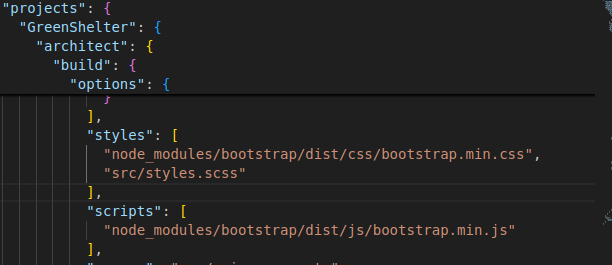
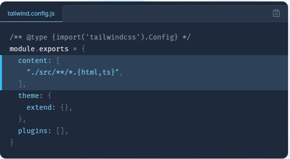

# GreenShelter

This project was generated using [Angular CLI](https://github.com/angular/angular-cli) version 19.0.6.

# Angular

## Tabla de contenido

- [Instalar Node.js](#instalar-nodejs)
- [Instalar Angular CLI](#instalar-angular-cli)
- [Instalar dependencias adicionales](#instalar-dependencias-adicionales)
  - [Bootstrap](#bootstrap)
  - [Tailwind CSS](#tailwind-css)
    - [Formulario de tailwind](#formulario-de-tailwind)
  - [CDK](#cdk)
- [Development server](#development-server)
- [Code scaffolding](#code-scaffolding)
- [Building](#building)
- [Running unit tests](#running-unit-tests)
- [Running end-to-end tests](#running-end-to-end-tests)
- [Additional Resources](#additional-resources)

## Instalar Node.js

1. `sudo apt update`
1. `sudo apt upgrade`
1. `sudo apt install -y nodejs npm`
1. `node -v`
1. `npm -v`

## Instalar Angular CLI

1. Instala Angular CLI globalmente con npm: `npm install -g @angular/cli`
1. Verifica que Angular CLI esté instalado: `ng version`
1. Crea un nuevo proyecto: `ng new nombre-proyecto`
1. Entra en la carpeta del proyecto: `cd nombre-proyecto`
1. Inicia el servidor de desarrollo para probar la aplicación: `ng serve`
1. Abre tu navegador y ve a: `http://localhost:4200`

## Instalar dependencias adicionales

### Bootstrap 

1. Instalar bootstrap `npm i bootstrap@5.3.3`

Buscar los directorios node_modules/bootstrap/dist/css y node_modules/bootstrap/dist/js

abrir angular.json e insertar las rutas en styles y scripts lo que muestra la imagen



### Tailwind CSS

1. Instalar tailwindcss `npm install -D tailwindcss postcss autoprefixer`
1. Generar el arhivo tailwind.config.js `npx tailwindcss init`
1. Agregue las rutas a todos los archivos de plantilla en su tailwind.config.jsarchivo.

1. Agregue las @tailwinddirectivas para cada una de las capas de Tailwind a su archivo. ./src/styles.css

```bash
@tailwind base;
@tailwind components;
@tailwind utilities;
```

Ejecute su proceso de compilación con ng serve.

```bash
ng serve
```

Comience a utilizar las clases de utilidad de Tailwind para darle estilo a su contenido.

```bash
<h1 class="text-3xl font-bold underline">
  Hello world!
</h1>
```

Finalmente instalar la extencion Tailwind CSS InteliSens de visual studio code, lo que te permite la ver la representacion de una utilidad

#### Formulario de tailwind

[Plugin de tailwind](https://github.com/tailwindlabs/tailwindcss-forms) 

Instalar el plugin

```sh
npm install -D @tailwindcss/formsnpm install -D @tailwindcss/forms
```

Luego agregar el plugin al archivo `tailwind.config.js`:

```js
// tailwind.config.js
module.exports = {
  theme: {
    // ...
  },
  plugins: [
    require('@tailwindcss/forms'),
    // ...
  ],
}
```

### CDK

1. Agregar CDK `ng add @angular/cdk`

## Development server

To start a local development server, run:

```bash
ng serve
```

Once the server is running, open your browser and navigate to `http://localhost:4200/`. The application will automatically reload whenever you modify any of the source files.

## Code scaffolding

Angular CLI includes powerful code scaffolding tools. To generate a new component, run:

```bash
ng generate component component-name
```

For a complete list of available schematics (such as `components`, `directives`, or `pipes`), run:

```bash
ng generate --help
```

## Building

To build the project run:

```bash
ng build
```

This will compile your project and store the build artifacts in the `dist/` directory. By default, the production build optimizes your application for performance and speed.

## Running unit tests

To execute unit tests with the [Karma](https://karma-runner.github.io) test runner, use the following command:

```bash
ng test
```

## Running end-to-end tests

For end-to-end (e2e) testing, run:

```bash
ng e2e
```

Angular CLI does not come with an end-to-end testing framework by default. You can choose one that suits your needs.

## Additional Resources

For more information on using the Angular CLI, including detailed command references, visit the [Angular CLI Overview and Command Reference](https://angular.dev/tools/cli) page.

OJO CON 

```bash
<router-outlet></router-outlet>
```

## Configuracion de angular.json para mostrar imagenes

```bash
{
  "$schema": "./node_modules/@angular/cli/lib/config/schema.json",
  "version": 1,
  "newProjectRoot": "projects",
  "projects": {
    "GreenShelter": {
      "projectType": "application",
      "schematics": {
        "@schematics/angular:component": {
          "style": "scss"
        }
      },
      "root": "",
      "sourceRoot": "src",
      "prefix": "app",
      "architect": {
        "build": {
          "builder": "@angular-devkit/build-angular:application",
          "options": {
            "outputPath": "dist/green-shelter",
            "index": "src/index.html",
            "browser": "src/main.ts",
            "polyfills": [
              "zone.js"
            ],
            "tsConfig": "tsconfig.app.json",
            "inlineStyleLanguage": "scss",
            "assets": [
                "src/assets"
            ],
            "styles": [
              "node_modules/bootstrap/dist/css/bootstrap.min.css",
              "src/styles.scss"
            ],
            "scripts": [
              "node_modules/bootstrap/dist/js/bootstrap.min.js"
            ],
            "server": "src/main.server.ts",
            "outputMode": "server",
            "ssr": {
              "entry": "src/server.ts"
            }
          },
          "configurations": {
            "production": {
              "budgets": [
                {
                  "type": "initial",
                  "maximumWarning": "500kB",
                  "maximumError": "1MB"
                },
                {
                  "type": "anyComponentStyle",
                  "maximumWarning": "4kB",
                  "maximumError": "8kB"
                }
              ],
              "outputHashing": "all"
            },
            "development": {
              "optimization": false,
              "extractLicenses": false,
              "sourceMap": true
            }
          },
          "defaultConfiguration": "production"
        },
        "serve": {
          "builder": "@angular-devkit/build-angular:dev-server",
          "configurations": {
            "production": {
              "buildTarget": "GreenShelter:build:production"
            },
            "development": {
              "buildTarget": "GreenShelter:build:development"
            }
          },
          "defaultConfiguration": "development"
        },
        "extract-i18n": {
          "builder": "@angular-devkit/build-angular:extract-i18n"
        },
        "test": {
          "builder": "@angular-devkit/build-angular:karma",
          "options": {
            "polyfills": [
              "zone.js",
              "zone.js/testing"
            ],
            "tsConfig": "tsconfig.spec.json",
            "inlineStyleLanguage": "scss",
            "assets": [
              {
                "glob": "**/*",
                "input": "public"
              }
            ],
            "styles": [
              "src/styles.scss"
            ],
            "scripts": []
          }
        }
      }
    }
  },
  "cli": {
    "analytics": false
  }
}

```
